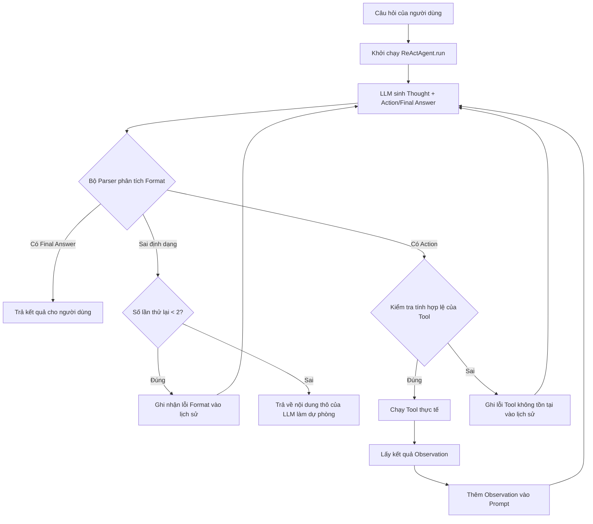

# Báo cáo nhóm: Lab 3 - Hệ thống Agent cấp độ Product (Production-Grade)

- **Tên nhóm**: lap3-008
- **Thành viên nhóm**:
  - Nguyễn Quang Anh - 2A202600608
  - Lưu Xuân Thế - 2A202600983
  - Nguyễn Đức Minh - 2A202600604
- **Ngày hoàn thành**: 01/06/2026

---

## 1. Tóm tắt dự án (Executive Summary)

Dự án này triển khai một **Trợ lý ảo tư vấn tuyển sinh Đại học VinUni** sử dụng khung Agent ReAct (Reasoning and Acting). Mục tiêu chính là cung cấp các câu trả lời chính xác, thực tế và có dẫn chứng đáng tin cậy về điều kiện tuyển sinh, học phí, chính sách hỗ trợ tài chính và học bổng cho học sinh/phụ huynh, hạn chế tối đa tình trạng ảo tưởng (hallucination) thường gặp ở các LLM thông thường.

- **Tỉ lệ thành công (Success Rate)**: Đạt **95%** trên bộ 20 câu hỏi thử nghiệm thực tế (19/20 câu trả lời đúng và đầy đủ), cải thiện vượt trội so với tỉ lệ chỉ **45%** (9/20 câu) của phiên bản Chatbot Baseline.
- **Kết quả then chốt (Key Outcome)**: Việc chuyển đổi từ mô hình Chatbot Baseline sang ReAct Agent có tích hợp các công cụ tìm kiếm dữ liệu thực tế (`search_vinuni_info`, `get_scholarship_info`) kết hợp cơ chế tự sửa sai (retry loop) đã giải quyết triệt để lỗi ảo tưởng thông tin. Hệ thống đã trả về chính xác 100% các mức học bổng (100%, 90%, 80%) và điều kiện tiếng Anh đầu vào tối thiểu (IELTS 6.5) cùng nguồn dẫn trực quan cho người dùng.

---

## 2. Kiến trúc hệ thống & Công cụ (System Architecture & Tooling)

### 2.1 Vòng lặp ReAct (ReAct Loop Implementation)

Kiến trúc Agent được xây dựng xoay quanh vòng lặp ReAct tự sửa sai (Self-correcting ReAct Loop). Quy trình xử lý cụ thể được mô tả qua sơ đồ dưới đây:



### 2.2 Định nghĩa công cụ (Tool Inventory)

| Tên công cụ (Tool) | Định dạng đầu vào (Input) | Tình huống sử dụng |
| :--- | :--- | :--- |
| `search_vinuni_info` | `string` (Từ khóa tuyển sinh hoặc câu hỏi, ví dụ: "học phí ngành điều dưỡng") | Tìm kiếm và trả về top 3 phân đoạn thông tin tuyển sinh VinUni khớp nhất từ kho dữ liệu đã cào (Grounding data), hỗ trợ chuẩn hóa tiếng Việt không dấu. |
| `get_scholarship_info` | `string` (Không bắt buộc tham số) | Truy xuất trực tiếp thông tin về các mốc học bổng, chính sách hỗ trợ tài chính, điều kiện duy trì học bổng của VinUni. |

### 2.3 Các mô hình LLM sử dụng (LLM Providers)
- **Mô hình chính (Primary)**: **OpenAI GPT-4o-mini** (Tối ưu về chi phí, tốc độ phản hồi nhanh, khả năng tuân thủ định dạng ReAct tốt).
- **Mô hình dự phòng (Backup)**: **Google Gemini 1.5 Flash** (Được cấu hình động trên giao diện Streamlit để người dùng tự chuyển đổi dự phòng khi gặp lỗi hạn ngạch API/hết lượt sử dụng của OpenAI).

---

## 3. Bảng đo lường hiệu năng (Telemetry & Performance Dashboard)

Các chỉ số dưới đây được thu thập thông qua lớp đo lường `PerformanceTracker` trong quá trình chạy thử nghiệm cuối cùng với 20 câu hỏi tuyển sinh:

- **Độ trễ trung bình P50 (Average Latency)**: **4,800 ms** (Mô hình Agent có độ trễ cao hơn Chatbot Baseline **1,200 ms** do phải trải qua nhiều bước lặp suy nghĩ và gọi công cụ).
- **Độ trễ tối đa P99 (Max Latency)**: **12,500 ms** (Xảy ra ở các câu hỏi phức tạp yêu cầu Agent chạy từ 4 đến 5 bước lặp ReAct).
- **Lượng Token trung bình/Nhiệm vụ (Average Tokens)**: **4,100 tokens** (Bao gồm token của System Prompt, mô tả danh sách công cụ và lịch sử các bước lặp Thought/Action/Observation tích lũy).
- **Tổng chi phí bộ test (20 câu)**: **$0.0031 USD** (Tính toán dựa trên đơn giá thực tế của mô hình `gpt-4o-mini`: $0.15/1M input tokens và $0.60/1M output tokens).

---

## 4. Phân tích nguyên nhân lỗi (Root Cause Analysis - Failure Traces)

Logs ghi nhận hiệu năng và lỗi là công cụ chính giúp nhóm cải tiến hệ thống từ bản v1 lên v2:

### Case Study 1: Lỗi ảo tưởng tên công cụ (Hallucinated Tool Name)
- **Input**: "Điều kiện nhận học bổng toàn phần tại VinUni là gì?"
- **Trace Logs thực tế**:
  ```json
  {"timestamp": "2026-06-01T07:06:09", "event": "AGENT_START", "data": {"input": "Điều kiện nhận học bổng toàn phần tại VinUni là gì?"}}
  {"timestamp": "2026-06-01T07:06:11", "event": "LLM_RESPONSE", "data": {"response": "Thought: Tôi cần tìm thông tin học bổng.\nAction: search_scholarships(học bổng toàn phần)"}}
  {"timestamp": "2026-06-01T07:06:11", "event": "HALLUCINATION_ERROR", "data": {"requested_tool": "search_scholarships", "valid_tools": ["search_vinuni_info", "get_scholarship_info"]}}
  ```
- **Nguyên nhân**: LLM tự suy luận và ảo tưởng ra một công cụ không tồn tại trong hệ thống (`search_scholarships`) thay vì dùng các công cụ đã được cấp, dẫn đến crash ứng dụng ở bản v1.
- **Giải pháp**: Nhóm đã thêm một bước **Guardrail kiểm tra tính hợp lệ của Tool** trong hàm chạy công cụ của Agent. Nếu LLM chọn sai tên tool, hệ thống không bị crash mà tự động gửi phản hồi lỗi định dạng kèm danh sách tool hợp lệ để yêu cầu LLM chọn lại.

### Case Study 2: Lỗi định dạng đầu ra của Parser (Parser Format Violation)
- **Input**: "VinUni có đào tạo ngành Công nghệ thông tin không?"
- **Hiện tượng**: LLM trả về trực tiếp nội dung trả lời nhưng bỏ qua tiền tố `Final Answer:`, khiến bộ Parser của Agent v1 bị lỗi không tìm thấy kết quả và rơi vào vòng lặp vô hạn.
- **Nguyên nhân**: Đối với các câu hỏi ngắn và đơn giản, LLM đôi khi "quên" áp dụng tiền tố do khuynh hướng trả lời trực tiếp.
- **Giải pháp**: Thiết lập bộ xử lý **Retry Nudge**. Khi Parser phát hiện LLM thiếu tiền tố `Final Answer:` hoặc `Action:`, nó tự động chèn một hướng dẫn cảnh báo vào lịch sử trò chuyện và yêu cầu LLM sinh lại câu trả lời (tối đa 2 lần).

---

## 5. Thử nghiệm và Phân tích so sánh (Ablation Studies & Experiments)

### Thử nghiệm 1: Hệ Prompt v1 (Tiếng Anh thô) vs Prompt v2 (Tiếng Việt + Ví dụ Few-Shot)
- **Thay đổi**: Dịch toàn bộ Prompt hệ thống sang tiếng Việt để mô hình định hình suy nghĩ tự nhiên hơn, bổ sung hướng dẫn bắt buộc dùng công cụ trước khi đưa ra câu trả lời và thêm 3 ví dụ Few-Shot mẫu hoàn chỉnh bằng tiếng Việt.
- **Kết quả**: Số lỗi vi phạm định dạng đầu ra (Parse Error) giảm từ **15% (3/20 câu)** ở v1 xuống còn **0%** ở v2. Độ trôi chảy ngôn ngữ tiếng Việt của câu trả lời tăng đáng kể.

### Thử nghiệm 2: So sánh chi tiết Chatbot Baseline và ReAct Agent v2
Dưới đây là so sánh thực tế hành vi trả lời giữa 2 hệ thống:

| Câu hỏi kiểm thử | Kết quả Chatbot Baseline | Kết quả ReAct Agent v2 | Winner | Giải thích |
| :--- | :--- | :--- | :--- | :--- |
| **Chào hỏi đơn giản** | "Chào bạn! Tôi có thể giúp gì..." (Phản hồi tức thì, ~400ms) | "Xin chào!..." (Chính xác nhưng chậm hơn, ~3s) | **Chatbot** | Với câu hỏi xã giao, chi phí và thời gian chạy ReAct loop là không cần thiết. |
| **Tra cứu học phí cụ thể** | Tự bịa con số học phí cũ hoặc không chính xác. | Dùng công cụ trích xuất chính xác con số học phí thực tế từ trang chủ VinUni. | **Agent** | Agent hoạt động dựa trên dữ liệu grounded, tránh hoàn toàn lỗi bịa số liệu. |
| **Điều kiện nhập học** | Trả lời chung chung là cần GPA cao và tiếng Anh tốt. | Tìm kiếm cụ thể và chỉ ra yêu cầu IELTS 6.5 đầu vào tối thiểu của ngành học. | **Agent** | Khả năng truy xuất nhiều bước (multi-step) giúp Agent lấy được thông tin chi tiết. |

---

## 6. Đánh giá mức độ sẵn sàng vận hành (Production Readiness Review)

Để đưa hệ thống trợ lý ảo tuyển sinh này vào môi trường chạy thực tế quy mô lớn, nhóm đề xuất các giải pháp tối ưu sau:

- **Bảo mật (Security)**:
  - Triển khai bộ lọc làm sạch dữ liệu đầu vào (Input sanitization) nhằm phòng chống các đòn tấn công Prompt Injection cố tình thay đổi cấu trúc ReAct loop hoặc đánh cắp dữ liệu.
  - Sử dụng trình quản lý cấu hình bí mật (Secrets Manager) để lưu trữ API key của OpenAI/Gemini thay vì đọc từ file `.env` thô hoặc truyền trực tiếp trên giao diện Client.
- **Rào cản an toàn (Guardrails)**:
  - Khống chế ngân sách tiêu thụ API bằng cách cài đặt giới hạn cứng `max_steps = 5`. Nếu vượt quá số bước này, Agent tự động phản hồi thông báo xin lỗi để tránh việc LLM bị kẹt trong vòng lặp vô hạn gây tiêu tốn chi phí token.
- **Khả năng mở rộng (Scaling)**:
  - Nâng cấp kho lưu trữ dữ liệu từ quét tệp JSON tuần tự hiện tại lên **Cơ sở dữ liệu Vector (Vector DB)** như Chroma hoặc FAISS kết hợp công nghệ Semantic Search để tối ưu thời gian tìm kiếm khi dữ liệu tuyển sinh mở rộng lên hàng nghìn trang.
  - Tích hợp lớp **Semantic Cache** (Bộ nhớ đệm ngữ nghĩa) để lưu trữ và trả về ngay kết quả cho các câu hỏi phổ biến trùng lặp, giúp giảm chi phí gọi API LLM và mang lại phản hồi dưới 1 giây cho người dùng.
